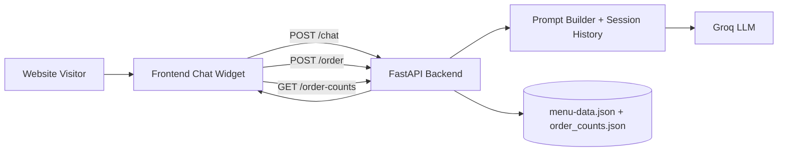

# Imaginary Pizzeria Chatbot Case Study

## 1. Project Summary

This project is a portfolio case study that demonstrates how to add a configurable AI chatbot to a business website.

The demo brand is **Vicolo Pizzeria**. The product idea behind it is the real service:

- A client already has a website.
- They want a chatbot that can answer customer questions and help with ordering.
- They want something practical, fast to integrate, and easy to customize.

The pizzeria website is intentionally a dummy storefront used as a realistic implementation example.

---

## 2. Business Problem

Many small businesses lose conversions when visitors cannot quickly get answers to simple questions:

- "What is your most popular item?"
- "How long is delivery?"
- "Are you open now?"
- "Can I customize this order?"

This project solves that by adding a lightweight chat assistant that:

- Uses real business data (menu, ingredients, opening hours, contact info).
- Guides users toward ordering.
- Is constrained to avoid hallucinating products that do not exist.

---

## 3. Solution Overview

The solution is a full-stack chatbot integration blueprint:

- **Frontend widget** embedded into a normal website (HTML/CSS/JS).
- **Backend API** (FastAPI) that handles chat, order counters, rate limiting, and API-key access.
- **LLM provider integration** (Groq, openai/gpt-oss-20b) for natural language responses.
- **Menu-aware prompt engineering** to keep answers aligned with actual shop offerings.

### Core behavior

- Chat session persistence per user (session id stored in localStorage).
- Restricts suggestions to real pizzas and real ingredients from data files.
- Uses real order counts to answer popularity questions.
- Supports "place order" telemetry with persisted counts in JSON.
- States plainly that it cannot place an order itself, and points at the UI control that can.
- Retries a failed generation server-side and reports the failure honestly rather than masking
  it with a canned apology.

---

## 4. Architecture



---

## 5. Tech Stack

- Python 3.13+
- FastAPI + Uvicorn
- Groq SDK
- Pydantic
- Vanilla HTML/CSS/JavaScript frontend
- Pytest for backend tests
- uv for dependency and runtime management

---

## 6. Frontend Versions

The repository ships **two complete, independently viewable frontends** against one backend. Both
are served by the same FastAPI process, so no extra setup is needed to compare them:

| | URL | Directory |
|---|---|---|
| **Original** | `http://127.0.0.1:8000/` | `frontend/` |
| **Version B** | `http://127.0.0.1:8000/v2/` | `frontend/v2/` |

Version B redesigns the *presentation layer only*. It uses the same API contract, the same
`data/menu-data.json`, the same cart model and the same cart to assistant handoff. Nothing in the
backend is version-specific — `frontend/v2/` is served with zero backend configuration because
`StaticFiles` is mounted at `/` with `html=True`.

What differs in Version B:

- Its own design system (`frontend/v2/css/tokens.css`), with the reasoning recorded in
  [`frontend/v2/DESIGN.md`](frontend/v2/DESIGN.md).
- Responsive WebP imagery from `frontend/images/webp/` with PNG fallback via `<picture>`; the
  original continues to serve the source PNGs unchanged.
- The assistant is docked into the page rather than floating as a detached widget.
- The menu badges the genuinely most-ordered pizza, from `GET /order-counts`.
- Markdown emphasis in assistant replies is rendered as real emphasis; the original shows the raw
  asterisks.
- Assistant failure handling: a 30-second client-side timeout, a distinct message per failure mode,
  and a Retry action that re-sends without duplicating the message.

The menu section's concept is deliberately unchanged between the two so they stay comparable.

> Regenerating the WebP set (only needed if the source PNGs change):
> `bash frontend/v2/tools/build-images.sh`

---

## 7. Repository Structure

```text
src/
	api.py           # Backend API, auth, rate limit, chat + order endpoints
	menu.py          # Single loader/saver for menu-data.json + standalone CLI (add pizza/ingredient, export CSV)
frontend/
	index.html       # ORIGINAL version - demo site with embedded chat widget
	style.css
	images/          # 7 pizza photos + hero_section.png, interior.png (source PNGs)
		webp/          # Generated responsive WebP variants, used by Version B
	js/
		config.js      # Frontend API base URL; fetches the API key from /client-key at load time
		data.js        # Pizza card themes/emoji + image lookup
		menu.js        # Fetches /menu-data, renders the pizza grid + customize modal (popup)
		cart.js        # Cart state and order handoff to chat
		footer.js      # Fetches /shop-info, fills in footer contact/hours
		chat.js        # Chat widget behavior and API calls
		app.js         # App bootstrap: header, cart UI wiring, init order
	v2/              # VERSION B - independent frontend, same API (served at /v2/)
		index.html
		DESIGN.md      # Design record: tokens, motion, contrast, decisions and their reasons
		css/           # tokens / base / components / layout / overlays
		js/            # config, data, menu, cart, chat, shop, motion, overlay, app
		tools/
			build-images.sh  # Regenerates frontend/images/webp/ from the source PNGs
data/
	menu-data.json   # Business menu + shop metadata source
	menu-data.csv    # CSV export generated by the menu.py CLI
	order_counts.json
tests/
	test_api.py      # Backend tests (auth, health, history, rate limit, order popularity)
```

---

## 8. Key Features

### Customer-facing

- Two complete frontends to compare (see -> 6. Frontend Versions).
- Chat assistant embedded in the website.
- Instant answers for menu, hours, delivery, pickup, and recommendations.
- Conversation memory during session.
- Friendly failure messaging when the backend is unavailable, slow, or returns nothing usable.

### Business-facing

- Configurable business data through `data/menu-data.json`.
- Order popularity tracking through `data/order_counts.json`, surfaced both in the assistant's
  recommendations and (in Version B) as a menu badge.
- API key protection for non-public endpoints.
- Basic IP-based rate limiting.
- CORS configuration via environment variable.

---

## 9. API Endpoints

### Public

- `GET /health` - health check
- `GET /shop-info` - returns shop metadata
- `GET /menu-data` - returns the full menu (pizzas, ingredients, shop info)
- `GET /order-counts` - returns pizzas **ranked** by how often they are ordered, most first.
  Deliberately returns the ranking and never the counts: the assistant is instructed never to
  state real order numbers, so the endpoint holds the same line. Pizzas with no orders are
  omitted, so an empty list means "no data yet".
- `GET /client-key` - returns the frontend's `x-api-key` value (not a security boundary, see §13)

### Protected (requires `x-api-key`)

- `POST /chat`
	- Input: `message`, optional `session_id`
	- Query param: `include_history` (default false)
	- Output: `session_id`, assistant `message`, optional `history`

- `GET /history/{session_id}`
	- Returns chat history for a session

- `POST /order`
	- Input: list of pizzas and quantities
	- Updates and returns order counters

---

## 10. How to Run Locally

### 1) Install dependencies

```powershell
uv sync
```

### 2) Configure keys

You can set environment variables:

```powershell
$env:GROQ_API_KEY="your_groq_key"
$env:BACKEND_API_KEY="your_backend_key"
```

Or use root-level key files:

- `groq_api_key.txt` — not committed; copy `groq_api_key.example.txt` to `groq_api_key.txt` and fill in your real Groq key
- `backend_api_key.txt` — a demo placeholder value is committed for convenience (see §13); replace it with your own for anything beyond local testing

### 3) Start backend + frontend (single process)

```powershell
uv run uvicorn src.api:app --reload
```

Then open either version:

- `http://127.0.0.1:8000/` - the original
- `http://127.0.0.1:8000/v2/` - Version B

The backend serves both directly from `frontend/`; no separate dev server or build step.

### 4) Run tests

```powershell
uv run pytest -q
```

---

## 11. Configuration Guide (for Real Client Projects)

This section is the reusable part when implementing for a customer.

### Backend-side configuration

- Set `GROQ_API_KEY`
- Set `BACKEND_API_KEY`
- Set `ALLOWED_ORIGINS` to the client domain(s)
- Optionally tune:
	- `RATE_LIMIT_COUNT` (default 20) and `RATE_LIMIT_WINDOW_SEC` (default 60)
	- `MAX_COMPLETION_TOKENS` (default 1200) - the completion budget per reply. `openai/gpt-oss-20b`
	  is a reasoning model, so its thinking is charged against this budget *before* any visible
	  text is produced. Set too low, calls return `finish_reason="length"` with empty or
	  mid-sentence content. Measured worst case here is ~365 tokens.
	- `REASONING_EFFORT` (default `low`) - keeps the reasoning trace short. For questions this
	  narrow it cut peak completion tokens from 318 to 181 with no loss of answer quality.
	- `EMPTY_REPLY_ATTEMPTS` (default 2) - total attempts per user message before giving up and
	  returning `503`.

### Business data customization

Update `data/menu-data.json`:

- Pizza names, ingredients, prices
- Shop contact details
- Opening hours
- Delivery/pickup info

No frontend logic change is required for these content updates.

### Frontend integration pattern

For this demo, the widget is part of the same repository and loaded directly in `index.html`. For a customer website, the same JS/CSS widget approach can be embedded in their existing page layout and pointed to the deployed backend URL.

---

## 12. Prompt Design Strategy

The assistant is intentionally constrained:

- It receives an always-on menu core.
- It is instructed to suggest only existing pizzas/ingredients.
- It uses real order counter data for popularity.
- It avoids inventing store details.
- It is told what it *cannot* do. The assistant is text-only: it has no tools, and no frontend
  code reads its replies for actions. Left unstated, the model plays the "ordering assistant"
  role convincingly enough to answer "Your order is set" and offer a checkout that does not
  exist — leaving a customer believing they had ordered when nothing was added. It now says it
  cannot place orders and names the control that can, while still doing the useful part
  (pricing a pizza with extras).

This makes responses more reliable for commerce scenarios where incorrect product info harms trust.

**These are mitigations, not a guarantee.** The assistant is still an LLM and can hallucinate — confidently state something false, misread a constraint, or blend unrelated context into an answer. Prompt-level grounding reduces how often that happens for menu/shop facts specifically; it does not eliminate the possibility, and it does nothing for topics outside that grounding. The chat widget shows a standing disclaimer ("AI responses can be wrong. Double-check anything important.") for this reason, and any real deployment should treat unverified LLM output the same way — assume it can be wrong until confirmed against the actual source data.

---

## 13. Security Notes

**This project is intentionally not secured to production standards.** The focus of this case study is the chatbot integration itself (prompt design, menu-grounding, session handling), not credential security — the auth setup below is a minimal stand-in on purpose, not a recommendation.

`frontend/js/config.js` fetches the API key from `GET /client-key` at page load instead of hardcoding it. This does **not** make the key secret — it's still fully visible to any visitor via the browser's Network tab, exactly as if it were hardcoded. The only thing it actually buys: `backend_api_key.txt` becomes the single place the key lives. If that file (and the `BACKEND_API_KEY` env var) is absent, `/client-key` returns an empty key and every protected endpoint (`/chat`, `/order`) responds `500 Server API key is not configured` — there is no hardcoded fallback anywhere in the code that would let the app silently keep working without it.

For convenience, this repository commits a demo `backend_api_key.txt` (a harmless local placeholder, not a paid credential) and sample data files in `data/` so reviewers can run the project quickly without extra setup. `groq_api_key.txt` is the one exception — it's a real third-party credential, so it's git-ignored; use `groq_api_key.example.txt` as the template and supply your own key (see -> 10. How to Run Locally).

### How a real production project would do this instead

- Never ship a static shared secret to the browser at all — the current `x-api-key` pattern is a placeholder, not something to imitate.
- Use a backend-for-frontend: the browser never sees a privileged key; your own server attaches it when calling out to protected resources.
- Issue short-lived, per-session tokens (e.g. an httpOnly signed cookie) when the page loads, scoped to that session and expiring quickly, instead of one long-lived key shared by every visitor.
- Authenticate real users where it matters, and rate-limit/monitor by identity, not just by IP.
- Never commit real secrets to git, even as "demo" files like the ones in this repo.

---

## 14. What This Case Study Demonstrates

This project demonstrates my ability to:

- Design a practical AI chatbot add-on for websites.
- Integrate LLMs into a real user flow (discover -> ask -> order).
- Build a clean backend API with auth, rate limits, and persistence.
- Use prompt constraints to reduce hallucinations.
- Deliver a client-facing demo that clearly communicates implementation value.

---

## 15. Roadmap (Next Production Steps)

- Multi-tenant support: run one backend that serves many businesses at once, each with its own menu/config, instead of deploying a separate copy per client
- Admin dashboard for menu and prompt editing
- Analytics (intent, conversion, drop-off)
- Better order orchestration (checkout/payment integration)
- Let the assistant act on the basket: structured actions validated against the real menu, with
  a confirmation step, rather than only describing what the customer should click
- Human handoff (live operator fallback)
- Retrieval-augmented docs for FAQs/policies

---

## 16. License

See `LICENSE`.