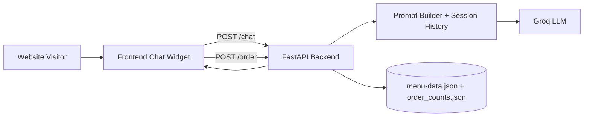

# Imaginary Pizzeria Chatbot Case Study

## 1. Project Summary

This project is a portfolio case study that demonstrates how to add a configurable AI chatbot to a business website.

The demo brand is **Vicolo Pizzeria**. The product idea behind it is the real service:

- A client already has a website.
- They want a chatbot that can answer customer questions and help with ordering.
- They want something practical, fast to integrate, and easy to customize.

The pizzeria website is intentionally a dummy storefront used as a realistic implementation example.

---

## 2. Business Problem

Many small businesses lose conversions when visitors cannot quickly get answers to simple questions:

- "What is your most popular item?"
- "How long is delivery?"
- "Are you open now?"
- "Can I customize this order?"

This project solves that by adding a lightweight chat assistant that:

- Uses real business data (menu, ingredients, opening hours, contact info).
- Guides users toward ordering.
- Is constrained to avoid hallucinating products that do not exist.

---

## 3. Solution Overview

The solution is a full-stack chatbot integration blueprint:

- **Frontend widget** embedded into a normal website (HTML/CSS/JS).
- **Backend API** (FastAPI) that handles chat, order counters, rate limiting, and API-key access.
- **LLM provider integration** (Groq, llama-3.3-70b-versatile) for natural language responses.
- **Menu-aware prompt engineering** to keep answers aligned with actual shop offerings.

### Core behavior

- Chat session persistence per user (session id stored in localStorage).
- Restricts suggestions to real pizzas and real ingredients from data files.
- Uses real order counts to answer popularity questions.
- Supports "place order" telemetry with persisted counts in JSON.

---

## 4. Architecture



---

## 5. Tech Stack

- Python 3.13+
- FastAPI + Uvicorn
- Groq SDK
- Pydantic
- Vanilla HTML/CSS/JavaScript frontend
- Pytest for backend tests
- uv for dependency and runtime management

---

## 6. Repository Structure

```text
src/
	api.py           # Backend API, auth, rate limit, chat + order endpoints
	menu.py          # Single loader/saver for menu-data.json + standalone CLI (add pizza/ingredient, export CSV)
frontend/
	index.html       # Demo pizzeria website with embedded chat widget
	style.css
	images/          # Pizza photos
	js/
		config.js      # Frontend API base URL; fetches the API key from /client-key at load time
		data.js        # Pizza card themes/emoji + image lookup
		menu.js        # Fetches /menu-data, renders the pizza grid + customize modal (popup)
		cart.js        # Cart state and order handoff to chat
		footer.js      # Fetches /shop-info, fills in footer contact/hours
		chat.js        # Chat widget behavior and API calls
		app.js         # App bootstrap: header, cart UI wiring, init order
data/
	menu-data.json   # Business menu + shop metadata source
	menu-data.csv    # CSV export generated by the menu.py CLI
	order_counts.json
tests/
	test_api.py      # Backend tests (auth, health, history, rate limit)
```

---

## 7. Key Features

### Customer-facing

- Floating chat widget on the website.
- Instant answers for menu, hours, delivery, pickup, and recommendations.
- Conversation memory during session.
- Friendly failure messaging when backend is unavailable.

### Business-facing

- Configurable business data through `data/menu-data.json`.
- Order popularity tracking through `data/order_counts.json`.
- API key protection for non-public endpoints.
- Basic IP-based rate limiting.
- CORS configuration via environment variable.

---

## 8. API Endpoints

### Public

- `GET /health` - health check
- `GET /shop-info` - returns shop metadata
- `GET /menu-data` - returns the full menu (pizzas, ingredients, shop info)
- `GET /client-key` - returns the frontend's `x-api-key` value (not a security boundary, see §12)

### Protected (requires `x-api-key`)

- `POST /chat`
	- Input: `message`, optional `session_id`
	- Query param: `include_history` (default false)
	- Output: `session_id`, assistant `message`, optional `history`

- `GET /history/{session_id}`
	- Returns chat history for a session

- `POST /order`
	- Input: list of pizzas and quantities
	- Updates and returns order counters

---

## 9. How to Run Locally

### 1) Install dependencies

```powershell
uv sync
```

### 2) Configure keys

You can set environment variables:

```powershell
$env:GROQ_API_KEY="your_groq_key"
$env:BACKEND_API_KEY="your_backend_key"
```

Or use root-level key files:

- `groq_api_key.txt` — not committed; copy `groq_api_key.example.txt` to `groq_api_key.txt` and fill in your real Groq key
- `backend_api_key.txt` — a demo placeholder value is committed for convenience (see §12); replace it with your own for anything beyond local testing

### 3) Start backend + frontend (single process)

```powershell
uv run uvicorn src.api:app --reload
```

Then open:

- `http://127.0.0.1:8000`

The backend serves the frontend files directly from `frontend/`.

### 4) Run tests

```powershell
uv run pytest -q
```

---

## 10. Configuration Guide (for Real Client Projects)

This section is the reusable part when implementing for a customer.

### Backend-side configuration

- Set `GROQ_API_KEY`
- Set `BACKEND_API_KEY`
- Set `ALLOWED_ORIGINS` to the client domain(s)
- Optionally tune:
	- `RATE_LIMIT_COUNT`
	- `RATE_LIMIT_WINDOW_SEC`

### Business data customization

Update `data/menu-data.json`:

- Pizza names, ingredients, prices
- Shop contact details
- Opening hours
- Delivery/pickup info

No frontend logic change is required for these content updates.

### Frontend integration pattern

For this demo, the widget is part of the same repository and loaded directly in `index.html`. For a customer website, the same JS/CSS widget approach can be embedded in their existing page layout and pointed to the deployed backend URL.

---

## 11. Prompt Design Strategy

The assistant is intentionally constrained:

- It receives an always-on menu core.
- It is instructed to suggest only existing pizzas/ingredients.
- It uses real order counter data for popularity.
- It avoids inventing store details.

This makes responses more reliable for commerce scenarios where incorrect product info harms trust.

**These are mitigations, not a guarantee.** The assistant is still an LLM and can hallucinate — confidently state something false, misread a constraint, or blend unrelated context into an answer. Prompt-level grounding reduces how often that happens for menu/shop facts specifically; it does not eliminate the possibility, and it does nothing for topics outside that grounding. The chat widget shows a standing disclaimer ("AI responses can be wrong. Double-check anything important.") for this reason, and any real deployment should treat unverified LLM output the same way — assume it can be wrong until confirmed against the actual source data.

---

## 12. Security Notes

**This project is intentionally not secured to production standards.** The focus of this case study is the chatbot integration itself (prompt design, menu-grounding, session handling), not credential security — the auth setup below is a minimal stand-in on purpose, not a recommendation.

`frontend/js/config.js` fetches the API key from `GET /client-key` at page load instead of hardcoding it. This does **not** make the key secret — it's still fully visible to any visitor via the browser's Network tab, exactly as if it were hardcoded. The only thing it actually buys: `backend_api_key.txt` becomes the single place the key lives. If that file (and the `BACKEND_API_KEY` env var) is absent, `/client-key` returns an empty key and every protected endpoint (`/chat`, `/order`) responds `500 Server API key is not configured` — there is no hardcoded fallback anywhere in the code that would let the app silently keep working without it.

For convenience, this repository commits a demo `backend_api_key.txt` (a harmless local placeholder, not a paid credential) and sample data files in `data/` so reviewers can run the project quickly without extra setup. `groq_api_key.txt` is the one exception — it's a real third-party credential, so it's git-ignored; use `groq_api_key.example.txt` as the template and supply your own key (see -> 9. How to Run Locally).

### How a real production project would do this instead

- Never ship a static shared secret to the browser at all — the current `x-api-key` pattern is a placeholder, not something to imitate.
- Use a backend-for-frontend: the browser never sees a privileged key; your own server attaches it when calling out to protected resources.
- Issue short-lived, per-session tokens (e.g. an httpOnly signed cookie) when the page loads, scoped to that session and expiring quickly, instead of one long-lived key shared by every visitor.
- Authenticate real users where it matters, and rate-limit/monitor by identity, not just by IP.
- Never commit real secrets to git, even as "demo" files like the ones in this repo.

---

## 13. What This Case Study Demonstrates

This project demonstrates my ability to:

- Design a practical AI chatbot add-on for websites.
- Integrate LLMs into a real user flow (discover -> ask -> order).
- Build a clean backend API with auth, rate limits, and persistence.
- Use prompt constraints to reduce hallucinations.
- Deliver a client-facing demo that clearly communicates implementation value.

---

## 14. Roadmap (Next Production Steps)

- Multi-tenant support: run one backend that serves many businesses at once, each with its own menu/config, instead of deploying a separate copy per client
- Admin dashboard for menu and prompt editing
- Analytics (intent, conversion, drop-off)
- Better order orchestration (checkout/payment integration)
- Human handoff (live operator fallback)
- Retrieval-augmented docs for FAQs/policies

---

## 15. License

See `LICENSE`.